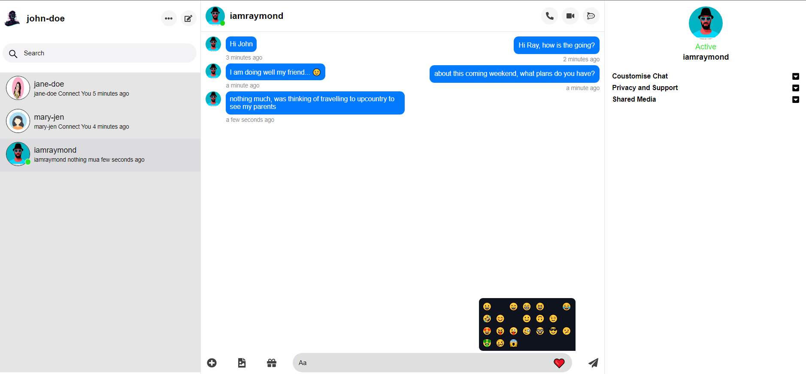

# Real Time Chat Application

A complete Real Time Live Chat Application by using MongoDB, Express, React, and Socket.io

  

## Technologies

- JavaScript
- NodeJS
- Express
- ReactJS
- Redux
- Socket.io
- SASS

## Setup

- Clone the project: `git@github.com:rOluochKe/real-time-chap-app.git`
- Change directory into : `cd /real-time-chap-app`
- Install required dependencies: `npm install`
- Change directory into frontend : `cd /frontend`
- Install required dependencies: `npm install`
- Change directory into socket : `cd /socket`
- Install required dependencies: `npm install`
- Configure database connection `cd /backend/config`, create a file `config.env` and copy contents from `config.example.env` to `config.env`
- Run app [backend] from `cd /socket`: and run : `npm run socket`
- Run app : `npm run dev`
- View app on: `http://localhost:3000`
